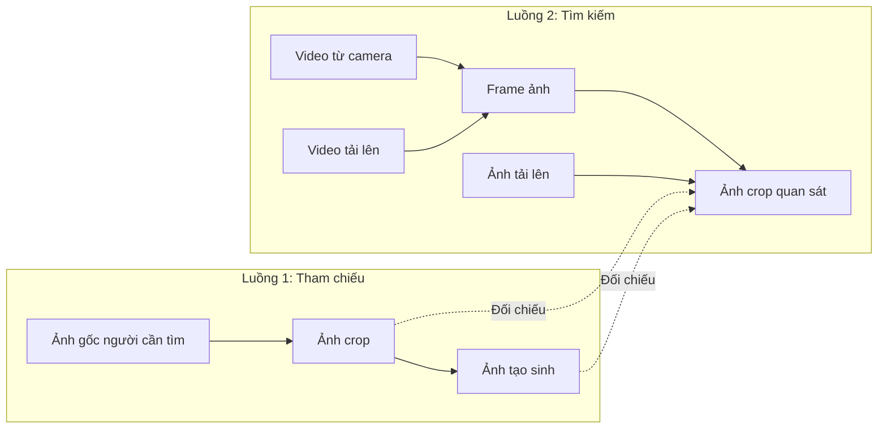

# Thiết kế database: hai luồng khuôn mặt

Schema PostgreSQL: `database/001_face_media.sql`. Đã áp dụng vào database trong
`src/.env`: đã xác minh sau commit có 9 bảng, 2 view và 12 khóa ngoại trong schema `face_media`. Chưa tích hợp API. Giữ nguyên thông tin kết nối.

## Luồng nghiệp vụ

1. **Tham chiếu (reference):** ảnh gốc người cần tìm → ảnh crop → ảnh tạo sinh.
2. **Tìm kiếm (search):** video từ camera / video tải lên / ảnh → ảnh crop khuôn mặt.

Crop tham chiếu và ảnh tạo sinh dùng để đối chiếu với crop thuộc luồng tìm kiếm.
Crop camera/video/ảnh gallery không phải đầu vào cho tạo sinh.



## Cấu trúc bảng

| Bảng | Vai trò |
|---|---|
| assets | Metadata file: storage key, SHA-256, MIME, dung lượng, kích thước |
| cameras | Camera, vị trí, tham chiếu bí mật kết nối |
| sources | Nguồn dữ liệu, bắt buộc purpose=reference hoặc search; kind=image/video/camera |
| frames | Frame thuộc nguồn; ảnh tĩnh dùng lại asset ảnh gốc, frame_index=0, offset_ms=0 |
| face_detections | Mặt phát hiện: bbox, landmarks, detector/version, chất lượng, run_id |
| face_crops | Các phiên bản crop/align/phục hồi, cấu hình và phép biến đổi tọa độ |
| generation_jobs | Chỉ nhận crop reference; model/version, trạng thái, tham số |
| generated_images | Output theo tuổi, seed, biến thể; truy về crop tham chiếu qua job |
| face_embeddings | Vector crop hoặc ảnh tạo sinh, kèm model/version/preprocessing |

Dùng chung bảng kỹ thuật nhưng tách rõ nghiệp vụ bằng purpose trên sources,
frames, face_detections, face_crops. Các khóa ngoại ghép (id, purpose) bắt buộc
nguồn → frame → detection → crop luôn cùng luồng. Purpose không có mặc định.
Nguồn reference chỉ được là ảnh. Nguồn search có thể là ảnh, video hoặc camera.
Job có input_purpose=reference cố định, FK chặn crop search làm input tạo sinh.

Một ảnh có nhiều mặt, một mặt có nhiều crop, một crop reference có nhiều job;
một job có nhiều tuổi và nhiều biến thể cùng tuổi. UUID do ứng dụng tạo.
Track ID chỉ có ý nghĩa trong cùng nguồn/lần chạy tracker, không phải danh tính.

## Cách ghi dữ liệu

- Reference: lưu ảnh gốc → nguồn reference/image → frame ảnh tĩnh → detection →
  crop → job → ảnh tạo sinh. Giữ từng bản crop khi thay đổi restore/align.
- Search ảnh: lưu ảnh → nguồn search/image → frame ảnh tĩnh → detection → crop.
- Search video: lưu video → nguồn search/video → frame được chọn → detection → crop.
- Search camera: một nguồn search/camera cho mỗi phiên thu, kèm camera_id và thời
  gian bắt đầu. Lưu frame được chọn; bản ghi video của phiên là tùy chọn.

Video dùng timestamp/PTS decoder cho offset_ms, không suy thời gian từ FPS với
video có FPS biến đổi. Camera ghi thêm captured_at theo UTC. Bbox là tọa độ pixel
[x1,y1,x2,y2) của frame gốc; clamp trong kích thước frame. Lưu frame gốc trước
xử lý và ghi cấu hình tiền xử lý vào crop. Không ghi đè dữ liệu quan sát gốc.
Lưu crop hợp lệ trước khi lọc top matches để giữ dữ liệu gallery đầy đủ.

## Lưu file

Database lưu metadata; file ảnh/video lưu trên ổ đĩa hoặc object storage:

```text
reference/originals/{source_uuid}/{asset_uuid}.jpg
reference/crops/{detection_uuid}/{crop_uuid}.png
reference/generated/{job_uuid}/{generated_uuid}.png
search/originals/{source_uuid}/{asset_uuid}.mp4
search/frames/{source_uuid}/{frame_uuid}.jpg
search/crops/{detection_uuid}/{crop_uuid}.png
```

Đuôi file phải theo MIME thực tế; nguồn search ảnh dùng jpg/png tương ứng.
Các file hiện tại trong outputs có thể đăng ký nguyên đường dẫn tương đối.
Không lưu URL có token hoặc đường dẫn tuyệt đối phụ thuộc máy. SHA-256 không
unique vì ảnh giống nhau vẫn có thể thuộc nhiều nguồn/thời điểm quan sát.

Ghi file tạm, kiểm tra ghi thành công, đổi tên sang key cuối rồi ghi DB trong
transaction. Dọn file mồ côi sau khoảng chờ khi DB rollback. FK chặn xóa nguồn
còn dữ liệu phụ thuộc; kiểm tra mọi tham chiếu trước khi xóa file.

Service khi tích hợp phải kiểm tra: đúng loại asset ở mỗi vai trò, bbox nằm
trong frame, ảnh tĩnh dùng đúng asset nguồn/index 0, asset crop không đồng thời
là output tạo sinh, vector chỉ chứa số hữu hạn và đúng chuẩn hóa. DDL chưa có
trigger kiểm tra các điều kiện liên bảng này. Chỉ so vector cùng model/version/
preprocessing. FAISS có thể dựng lại từ DB; lưu mapping FAISS ID → embedding UUID.

## Điểm tích hợp

| File | Ghi dữ liệu |
|---|---|
| backend/api/routers/session.py | Reference: ảnh gốc, detection, crop |
| backend/api/job_runner.py | Reference: job, ảnh tạo sinh |
| backend/api/routers/video_verify.py | Search: video, frame, detection, crop |
| backend/api/session_store.py | Cache runtime; bổ sung repository DB cho metadata lâu dài |

Luồng upload ảnh gallery và thu camera cần bổ sung điểm ghi search khi triển khai.
Session_id chỉ là mã tương quan vì session hiện nằm trong RAM. Thiết kế này chưa
thêm bảng hồ sơ người mất tích hoặc kết quả đối soát; similarity không phải xác
nhận danh tính và không làm thay đổi nguồn gốc của ảnh.

## Khởi tạo và truy vấn

Chạy SQL một lần trên database đích bằng công cụ PostgreSQL. Schema có transaction
và không dùng IF NOT EXISTS để tránh che giấu cấu trúc khác phiên bản. Đây là bản
DDL khởi tạo đã chỉnh sửa, không phải migration cho schema cũ đã được triển khai.

```sql
-- Chỉ crop quan sát của luồng tìm kiếm.
SELECT * FROM face_media.search_face_gallery
WHERE source_id = '00000000-0000-0000-0000-000000000001';

-- Truy ảnh tạo sinh về crop và ảnh gốc thuộc luồng tham chiếu.
SELECT * FROM face_media.generated_image_lineage
WHERE job_id = '00000000-0000-0000-0000-000000000002';
```

Áp dụng quyền xem và thời hạn lưu đồng thời cho file và metadata. Giao diện cần
phân biệt ảnh tạo sinh với ảnh quan sát thực tế. Không commit .env.

