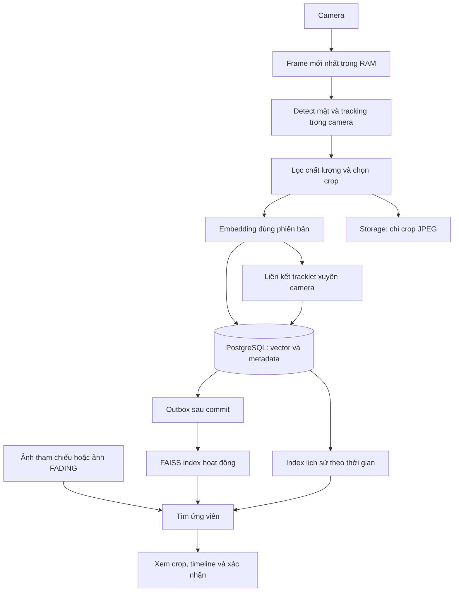

# Kiến trúc đa camera: duy trì ID và chỉ lưu crop khuôn mặt

Ngày thiết kế: 26/09/2026. Trạng thái: **P0–P4 đã triển khai vào runtime
(xem “Phụ lục A — Đối chiếu triển khai” cuối tài liệu). Các ngưỡng/giả định
tính tải vẫn cần đo thực tế trước khi chốt production (dùng scripts/bench_crop_jpeg.py,
scripts/calibrate_link.py, scripts/soak_camera.py).**

Yêu cầu đã chốt: chỉ lưu ảnh mặt đã crop cho luồng camera; tiết kiệm cả RAM và dung lượng ổ đĩa. Không ghi video hoặc ảnh toàn khung của luồng này. Embedding và metadata vẫn cần cho tìm kiếm và truy vết. Số camera, GPU, thời gian lưu chưa chốt; các con số dưới đây là giả định tính tải, không phải kết quả benchmark.

## 1. Quyết định chính

1. **Lọc trước khi ghi:** tracking trong từng camera, gom thành tracklet và giữ 1–3 crop đại diện cho mỗi lượt xuất hiện.
2. **Tách ảnh và dữ liệu tìm kiếm:** crop JPEG trong storage; metadata và vector gốc trong PostgreSQL; FAISS là chỉ mục có thể dựng lại.
3. **Giới hạn nhiều chiều:** crop/tracklet, byte/camera/ngày, tổng storage, track đang mở, hàng đợi frame, RAM index và thời gian lưu.
4. **ID toàn cục là giả thuyết:** kết hợp tương đồng khuôn mặt và không-thời gian, cho phép chưa xác định và sửa gán nhầm; tách khỏi xác nhận người mất tích.
5. **MVP tận dụng hệ thống có sẵn:** FastAPI, InsightFace, PostgreSQL/Supabase, lớp storage và FAISS; một tiến trình inference riêng, một tiến trình API, chưa cần cụm microservice.

## 2. Điểm cần thay đổi trong mã nguồn hiện tại

| Hiện trạng đã đọc từ mã | Hệ quả | Hướng thay đổi |
|---|---|---|
| `backend/api/ingest.py::persist_observation_frame()` lưu frame gốc trước crop | Tắt video vẫn phát sinh ảnh toàn khung | Đường ghi camera crop-only; frame chỉ còn metadata |
| Lưu mọi crop đạt ngưỡng detector và embedding tương ứng | Người đứng lâu tạo nhiều ảnh/vector gần trùng | Chọn mẫu theo tracklet trước persistence |
| `backend/api/cameras.py` dùng queue 8 frame/phiên | RAM tăng theo camera và độ phân giải | Queue 1–2 frame, bỏ frame cũ khi đầy, cap tổng byte |
| Producer `cap.read()` rồi sleep; timestamp là giờ host đọc | Có nguy cơ frame trễ do bộ đệm decoder | Đọc/drain stream liên tục, chọn frame mới nhất, đo độ trễ |
| Consumer giữ kết nối DB xuyên vòng lặp | Có thể giữ connection/transaction lâu và cạn pool | Batch nhỏ, transaction ngắn; trả connection trước khi chờ frame |
| Gallery dùng `fetchall()`, list vector, `np.stack()` và FAISS copy | Nhiều bản sao RAM khi rebuild | Đọc và add theo batch; giới hạn peak RAM |
| Rebuild mặc định `ORDER BY e.created_at LIMIT 100000` | Lấy phần đầu, có thể bỏ vector mới | Partition và watermark; công bố phạm vi index rõ ràng |
| `src/search/deduplicate.py` cần identity đầu vào | Không tự tracking hay tạo ID xuyên camera | Tracker và association riêng; dedupe dùng sau đó |
| `frames.asset_id` hiện `NOT NULL` trong migration 001 | Không thể chỉ bỏ ghi file frame | Migration mới + sửa repository và API đọc metadata-only |

Đây là nhận xét từ đọc mã, chưa phải đo tải. Không sửa migration 001–004 đã có, không xóa dữ liệu cũ trong bước thiết kế.

## 3. Luồng xử lý



Frame sống trong RAM đến hết inference/crop rồi giải phóng; không ghi vào log, event bus hoặc file tạm. Payload lưu bền chỉ gồm crop được chọn, vector và metadata. Không dùng base64 hoặc frame nguyên khung làm payload hàng đợi bền.

FADING chạy theo job tìm kiếm riêng. Ảnh sinh là query có provenance; không đưa vào quan sát camera hoặc tự cập nhật mẫu ID. Nếu chung GPU ít VRAM, admission control xếp diffusion chờ hoặc chuyển GPU khác. Mutex diffusion hiện tại chưa đủ điều phối tài nguyên của cả camera và diffusion.

| Khóa | Ý nghĩa | Vòng đời |
|---|---|---|
| `tracklet_id` | Đoạn theo dõi liên tục trong một camera | Đóng khi mất dấu quá timeout; local key có camera + phiên + local ID |
| `global_identity_id` | Giả thuyết nhiều tracklet thuộc cùng người | Có revision, có thể tách/gộp lại |
| `case_id` / hồ sơ người mất tích | Danh tính nghiệp vụ có ảnh tham chiếu | Liên kết qua tìm kiếm và xác nhận độc lập |

Global ID không phải tên người, không đồng nghĩa `human_confirmed` trong `search_results`.

## 4. Chọn crop và nén ảnh

### 4.1. Loại ảnh trùng trước khi ghi

Mỗi tracklet giữ tối đa 3 ứng viên trong RAM: ảnh rõ nhất gần chính diện và tối đa 2 ảnh góc khác hữu ích. Đánh giá độ nét, kích thước mặt thực, che khuất, phơi sáng và góc mặt; confidence detector không đủ đánh giá khả năng nhận dạng.

- Chọn mẫu đầu đủ chất lượng để có kết quả sớm. Khi cắt crop phải copy vùng mặt, tránh NumPy view giữ tham chiếu tới toàn bộ frame.
- Chỉ thay mẫu khi chất lượng tốt hơn đáng kể hoặc thêm góc hữu ích. Không thay chỉ vì cosine dao động nhẹ.
- Frame còn lại chỉ cập nhật thời gian đầu/cuối, số quan sát và thống kê trong RAM. Persist trạng thái theo nhịp giới hạn, không tạo hàng DB cho từng frame.
- Chốt 1–3 crop khi tracklet đóng. Nếu lưu sớm, dùng slot có revision và giới hạn tốc độ thay slot; crop cũ vào GC khi hết tham chiếu.
- Người đứng lâu không sinh tracklet mới mỗi phút. Checkpoint cùng tracklet, kèm hard timeout và quota để tracker lỗi cũng không tăng vô hạn.
- Tracker đứt có thể tạo nhiều tracklet cho một người: dùng cooldown cho lượt quay lại, quota camera/ngày và TTL. Không ép gộp hai người chỉ để giảm dung lượng.
- SHA-256 hỗ trợ nhận biết file trùng byte. Hash ảnh gần giống chỉ hỗ trợ lọc trong tracklet, không dùng xác định danh tính xuyên camera.

**Không chỉ giữ một ảnh cho toàn bộ cuộc đời ID:** cần góc mặt và bằng chứng theo camera. Bộ mẫu ID có tối đa 3 mẫu/không gian embedding, tham chiếu crop/vector sẵn có; crop theo lượt xuất hiện chỉ giữ trong cửa sổ retention. Không tạo bản sao ảnh/vector cho mỗi liên kết ID.

### 4.2. Thông số khởi điểm cần đo

| Thuộc tính | Đề xuất thử nghiệm | Điều kiện |
|---|---|---|
| Định dạng | JPEG | Tận dụng pipeline hiện tại |
| Kích thước | Cạnh dài tối đa 256 px, giữ tỉ lệ | Chỉ giảm ảnh lớn; không upscale mặt nhỏ |
| Chất lượng | So Q80, Q85, Q90; bắt đầu Q85 | Đo nhận dạng sau giải mã |
| Số crop | 1–3/tracklet, trung bình tính tải là 2 | Ưu tiên chất lượng và khác góc |
| Thumbnail | Tạo khi đọc, cache giới hạn | Không lưu thêm một bản mặc định |
| Metadata ảnh | Giữ trong DB | Tránh nhúng lặp camera/time vào file |

OpenCV có cờ chất lượng JPEG và tối ưu mã hóa; WebP là ứng viên benchmark thêm, không giả định luôn nhỏ hơn hoặc nhanh hơn. [Tài liệu OpenCV](https://docs.opencv.org/4.x/d8/d6a/group__imgcodecs__flags.html)

Giữ đủ vùng quanh mặt và landmark quy về tọa độ crop để căn chỉnh lại. Kích thước input model không tự động là kích thước ảnh lưu tối ưu. Ghi transform, kích thước nguồn, codec/resize và preprocessing version.

Embedding trước nén có thể khác embedding tính lại từ crop giải mã. Giữ provenance rõ ràng, đánh giá cả hai nhánh. Không coi ảnh phục hồi/tạo sinh là bằng chứng gốc.

### 4.3. Vị trí lưu

MVP dùng `MediaStorage`: local SSD hoặc bucket private Supabase. DB chỉ giữ khóa file, checksum, byte size và metadata; không lưu ảnh base64/JSON. Không để tên người hoặc credential camera trong storage key. Có thể chia prefix camera/ngày khi nhiều file. Chưa cần gộp archive riêng vì làm xóa từng crop và truy xuất ngẫu nhiên phức tạp hơn.

## 5. Duy trì ID xuyên camera

MVP theo dõi bbox mặt trong từng camera bằng chuyển động/IoU và embedding có chất lượng. ByteTrack là tham khảo cho association trong một camera; cần kiểm thử khi áp dụng cho detector mặt, và không tự giải quyết ID xuyên camera. [Bài báo ByteTrack](https://arxiv.org/abs/2110.06864)

1. Mỗi tracklet tạo descriptor từ các mẫu tốt; giữ vector đơn lẻ đã chọn để giải thích/sửa gán nhầm, không chỉ centroid.
2. Tìm ứng viên theo site, model và thời gian gần đây. Topology thu hẹp vùng tìm; khi chưa đầy đủ, dùng như gợi ý mềm và có tìm lịch sử rộng hơn.
3. Re-rank bằng vector gốc, chất lượng và thời gian di chuyển. Cần ngưỡng chấp nhận cùng margin top-1/top-2; hiệu chỉnh trên cặp khác người khó, không lấy cố định cosine 0.7/0.9.
4. Thiếu bằng chứng: giữ unresolved hoặc ID tạm riêng. Khi không thấy mặt, không bảo đảm nối được ID; timeline phải thể hiện khoảng trống.
5. Chặn gán chung khi hai vị trí đồng thời không thể di chuyển tới nhau và timestamp đáng tin. Camera nhìn chồng lấn có thể cùng thấy một người; không cấm trùng thời gian cho mọi cặp.
6. Ghi assignment có score, lý do, model, topology version và revision. Một writer/site hoặc transaction kiểm tra version để tránh gán xung đột.
7. Chỉ cập nhật mẫu ID từ association đủ tin cậy, không đưa mẫu mơ hồ vào EMA; giới hạn 3 exemplar và tính lại khi sửa/tách/gộp ID.

Thiết kế tham khảo việc kết hợp trajectory, embedding và không-thời gian trong MTMC; không tuyên bố đạt cùng độ chính xác. [NVIDIA MTMC](https://docs.nvidia.com/mms/text/MDX_Multi_Camera_Tracking_App.html)

Ghi thời gian nhận, thời gian nguồn nếu lấy được và độ bất định. Dùng monotonic clock cho timeout, UTC cho liên camera. Stream trễ/reconnect phải tăng độ bất định và đóng tracklet thích hợp.

## 6. Vector: giảm số lượng trước khi nén mạnh

Với vector 512 chiều:

| Kiểu lưu | Payload/vector | 1 triệu vector | Lưu ý |
|---|---:|---:|---|
| Float32 | 2.048 byte | 1,91 GiB | Chưa tính DB, mapping và các bản sao RAM |
| Float16 | 1.024 byte | 0,95 GiB | Chỉ giảm nếu lớp lưu thực sự dùng 16 bit |
| SQ8 | Khoảng 512 byte | 0,48 GiB | Cộng tham số lượng tử/ID tùy index |
| PQ 64 mã × 8 bit | 64 byte mã | 0,060 GiB | Chưa gồm codebook/ID/vector gốc; có mất mát |

FAISS Flat dùng `4*d` byte/vector; HNSW thêm đồ thị; PQ nén theo số mã và bit/mã. Đây là kích thước thành phần index, không phải toàn ứng dụng. [FAISS indexes](https://github.com/facebookresearch/faiss/wiki/Faiss-indexes)

**MVP:** giữ float32 chuẩn hóa và giảm số vector bằng chọn mẫu; giữ `real[]` hiện có ở bước đầu. Cast NumPy sang float16 rồi ghi lại `real[]` không làm PostgreSQL lưu còn 16 bit. Float16 lưu bền cần encoding nhị phân/kiểu lưu phù hợp, version, dimensions và kiểm tra decode.

- Không serialize vector thành chuỗi JSON để lưu dài hạn.
- Tách không gian theo model, weights checksum/version, preprocessing, dimensions và metric; không trộn vector khác không gian.
- Index hoạt động giữ ID mới thấy trong cửa sổ cấu hình. Shard lịch sử nằm trên đĩa, nạp theo phạm vi tìm kiếm với LRU có cap RAM. TTL RAM khác TTL lưu bền.
- Tìm hồ sơ cũ phải fan-out có giới hạn qua shard còn retention, trả tiến độ/phạm vi đã tìm; không âm thầm chỉ tìm cửa sổ gần nhất.
- Flat là baseline retrieval. HNSW cân nhắc khi cần độ trễ thấp và đủ RAM; không phải mặc định tiết kiệm bộ nhớ. IVF-PQ xét khi RAM index thực sự là nút thắt. [Hướng dẫn FAISS](https://github.com/facebookresearch/faiss/wiki/Guidelines-to-choose-an-index)
- ANN/PQ tạo ứng viên rồi re-rank bằng float32. Re-rank không cứu ứng viên bị ANN bỏ sót; đo recall so với Flat.

### Đồng bộ index và peak RAM

Commit vector + metadata + outbox cùng transaction. Index worker nhận ít nhất một lần, dedupe event ID; một writer/shard. Query dùng base snapshot bất biến + delta snapshot version hóa. Không add/search đồng thời trên index đang sửa; phía ứng dụng phải quản lý đồng bộ. [FAISS FAQ](https://github.com/facebookresearch/faiss/wiki/FAQ)

Dựng base theo batch, ví dụ 2.000 vector, với watermark outbox nhất quán rồi replay phần mới hơn. Công bố index và mapping cùng version; update/delete có revision và tombstone. Cap delta, compact theo ngưỡng; không rebuild toàn bộ sau mỗi crop.

Peak RAM gồm **index cũ + index mới + delta + batch + mapping + model + queue**. Thiếu headroom thì hoãn hoặc rebuild từng shard. Đặt timeout query và thu hồi snapshot cũ khi hết reader, tránh tích lũy bản cũ. Không giả định mọi FAISS index đều tìm trực tiếp từ đĩa mà không cần RAM.

## 7. Ước lượng dung lượng crop-only

Ký hiệu: C camera; T tracklet/camera/ngày; K crop/tracklet; S byte/crop trung bình; E vector/crop; d chiều; b byte/chiều; D ngày lưu.

```text
N_crop/ngày      = C × T × K
Dung lượng ảnh   = C × T × K × S × D
Payload vector  = C × T × K × E × d × b × D
RAM frame queue ≈ C × queue_length × width × height × channels × bytes/channel
```

Giả định **1.000 tracklet/camera/ngày**, **2 crop/tracklet**, **30 KiB/crop**, **1 vector 512D float32/crop**, **30 ngày**. Tracklet là lượt xuất hiện, không phải người duy nhất; tracker đứt làm T tăng.

| Camera | Crop/ngày | Ảnh/ngày | Ảnh/30 ngày | Payload vector/30 ngày |
|---:|---:|---:|---:|---:|
| 4 | 8.000 | 0,23 GiB | 6,87 GiB | 0,46 GiB |
| 8 | 16.000 | 0,46 GiB | 13,73 GiB | 0,92 GiB |
| 32 | 64.000 | 1,83 GiB | 54,93 GiB | 3,66 GiB |

30 KiB là giả định ngân sách, phải đo p50/p95/p99 từ crop thực; 256 px không bảo đảm kích thước file. Tổng còn metadata, index SQL/FAISS, WAL, file chờ GC, snapshot và backup. Một bản backup đầy đủ làm riêng phần ảnh gần gấp đôi. Bảng này chưa phải tổng dung lượng mua ổ đĩa.

Nếu một lượt có 60 mẫu mặt mà giữ 2, số crop/vector giảm 30 lần; đây là phép tính minh họa, chưa đo trên camera thật. **Giảm mẫu trùng đáng ưu tiên hơn nén thêm vài byte vector.**

### RAM frame và crop

Frame BGR 1920×1080 uint8 khoảng 5,93 MiB. 8 camera × queue 8 frame có payload khoảng **380 MiB**; queue 2 frame khoảng **95 MiB**. Chưa tính decoder, frame đang xử lý, preprocessing, model và VRAM.

Crop BGR 256×256 giải mã chiếm 192 KiB dù JPEG chỉ vài chục KiB. Cache theo **tổng byte**. Ví dụ 8 camera × 20 track mở × 3 crop × 192 KiB ≈ 90 MiB. Cap số track, timeout và eviction rõ ràng; crop phải copy vùng cắt để không giữ toàn frame.

## 8. Schema và tương thích

Đề xuất migration mới; chưa tạo/chạy SQL production trong bản thiết kế:

| Thành phần | Thay đổi |
|---|---|
| `sources` | Chính sách lưu phiên camera, ví dụ crop_only; luồng reference giữ hợp đồng riêng |
| `frames` | Cho phép asset_id=NULL có điều kiện camera crop-only; thêm kích thước nguồn và timestamp provenance |
| `face_detections` | FK tracklet; giữ bbox/landmark/quality của crop đã chọn |
| `tracklets` | Camera/source/local ID, start/end, trạng thái, số quan sát, quality summary, expiry |
| `global_identities` | ID giả thuyết, trạng thái, revision, last_seen, expiry |
| `identity_assignments` | Tracklet/global ID, score, evidence, version, valid-from/to, lịch sử sửa |
| `identity_exemplars` | Tối đa 3 slot/ID/không gian vector, tham chiếu crop/embedding có sẵn |
| `outbox_events` | Event ID, entity/revision, upsert/delete, payload nhỏ, retry/watermark |
| `retention_jobs` / trạng thái xóa | Expiry, tombstone, retry, xác nhận xóa file/index |

Unique tracklet theo source + camera + local ID; mẫu idempotent theo tracklet + slot + revision. Một assignment hiện hành/tracklet, nhiều tracklet có thể cùng global ID với kiểm tra không-thời gian.

Ràng buộc camera crop-only liên quan nhiều bảng: dùng repository validation và DB trigger/thiết kế khóa phù hợp, không viết CHECK tham chiếu bảng khác. API trả `frame_available=false`, `frame_url=null`; viewer hiển thị crop, không hứa xem bối cảnh đã bỏ. Rà INNER JOIN tới frame asset để tránh làm mất kết quả metadata-only. Giữ view lineage ảnh tạo sinh hoạt động với reference cũ.

Index SQL ban đầu: camera/start, global ID/time, status/expiry và FK hay truy vấn. Partition ngày/tháng chỉ khi đo đủ lớn; lập kế hoạch FK và xóa quan hệ trước DROP partition. Không tạo hàng metadata/frame nếu không có crop/sự kiện cần giữ.

## 9. Retention, quota và quá tải

Số ngày lưu chưa chốt. Tách TTL crop, vector, tracklet, exemplar và audit; không ngầm giữ sinh trắc học vô thời hạn. Mẫu giữ lâu cho hồ sơ có lý do và quota riêng. Không tự xóa dữ liệu hiện có khi bật thử nghiệm.

| Tình huống | Hành vi |
|---|---|
| Queue inference đầy | Bỏ frame cũ, đếm số bỏ, giữ nhịp công bằng giữa camera |
| CPU/GPU quá tải | Giảm fps phân tích/số phiên nhận; báo degraded và effective fps |
| Candidate cache đầy | Bỏ mẫu kém, giữ mẫu tốt nhất; không tăng cache vô hạn |
| DB/storage lỗi | Spool đĩa chỉ crop được chọn + metadata, cap byte/TTL; không spool frame/video |
| Spool đầy | Dừng ghi/bỏ mẫu theo ưu tiên; báo mất dữ liệu, không trả persisted=true |
| Index trễ DB | Công bố watermark/lag, tìm delta nếu có; trả phạm vi đã lập chỉ mục |
| Gần đầy đĩa | GC dữ liệu hết hạn, giảm mẫu dư, từ chối nhận thêm khi chạm cap cứng |
| Mẫu bảo lưu chiếm hết quota | Báo hết dung lượng; không tự xóa mẫu còn cần cho hồ sơ |

Kiểm tra/reserve byte trước ghi để nhiều worker không cùng vượt cap. Có thể thử cảnh báo 80%, dừng 90% dung lượng được cấp; phần còn lại cho DB/WAL và phục hồi. Đây là ngưỡng thử nghiệm, cần điều chỉnh.

Xóa: tombstone để ẩn query → event xóa index → xóa file hết tham chiếu/bảo lưu → xóa vector/bản ghi con theo FK → hoàn tất. Retry idempotent; query kiểm tombstone DB khi index còn cũ. Orphan GC có khoảng chờ và tránh file đang upload. Backup có TTL riêng; restore áp dụng lại deletion ledger trước phục vụ tìm kiếm.

Crop-only không có video để replay các frame đã bỏ. Đo tỷ lệ bỏ sót cùng fps/chọn mẫu; không bảo đảm tracking liên tục khi không thấy mặt.

## 10. Lộ trình và nghiệm thu

| Bước | Công việc | Kiểm chứng |
|---|---|---|
| P0 | Camera crop-only, migration metadata-only, bỏ recorder trên đường này, sửa viewer | Không phát sinh video/full-frame; reference và lịch sử cũ vẫn đọc được |
| P1 | Tracker local + selector 1–3 crop + quota/cache cap | Người đứng lâu không tăng crop theo frame; giữ đủ chất lượng |
| P2 | Association xuyên camera + topology + revision | Đo IDF1, ID switches, false merge/split; camera chồng lấn, mặt khuất, người giống nhau |
| P3 | Active/history index, batch rebuild, delta/outbox | Peak RAM, recall/Flat, p95 latency; retry/crash không nhân bản |
| P4 | TTL/GC + dashboard + soak test | DB lỗi, đầy đĩa, reconnect; phục hồi được, GC không mất tham chiếu còn dùng |

Benchmark lưu ảnh: crop đã gán nhãn của camera thử nghiệm, Q80/85/90 và kích thước 192/256/320 cùng baseline chất lượng cao. Đo byte/crop, encode/decode, nhận dạng sau decode, false accept/false reject ở ngưỡng hiệu chỉnh. Chia calibration/test theo người và thời gian, tránh rò rỉ frame gần nhau. So chính sách 1/2/3 crop cả chất lượng tìm kiếm và dung lượng.

Đo tải 4 → 8 → 32 camera; không suy năng lực GPU chỉ từ số camera. Theo dõi RSS/VRAM, queue bytes/age, effective fps, dropped frames, active tracks, crop/ngày, DB/spool bytes, index lag và GC. Với quota/TTL cố định, soak test phải cho RAM ổn định và storage hội tụ về ngân sách.

Lần này chỉ viết thiết kế, không chạy test model/GPU. Ưu tiên triển khai **P0 + P1**: cắt ảnh toàn khung và crop lặp trước khi tối ưu ANN.

## 11. Đối chiếu thư viện nghiên cứu

[Thư viện nghiên cứu](thu-vien-nghien-cuu/README.md) cung cấp hướng thuật toán. Khi áp dụng cần phân biệt:

- 128 chiều float32 là 512 byte; 512 chiều float32 là 2.048 byte, chưa overhead.
- Exact nearest-neighbor không có nghĩa nhận diện người đúng 100%; ANN recall khác độ chính xác nhận dạng.
- HNSW thêm bộ nhớ, không bảo đảm sub-ms mọi trường hợp; không có giới hạn cứng 100.000 vector cho mọi Flat index.
- Template protection là lớp bảo vệ, không phải kho bắt buộc chứa thêm bản sao vector. Embedding vẫn nhạy cảm; dùng storage private, phân quyền, mã hóa hạ tầng và audit truy cập.
- Không áp dụng nguyên xi “mỗi frame thêm vector” hoặc “vượt cosine thì gán ID”: thiết kế này lọc trước lưu, quản lý bất định và giới hạn vòng đời.

## Phụ lục A — Đối chiếu triển khai (P0–P4)

| Bước | Triển khai | Kiểm chứng |
|---|---|---|
| P0 | `database/005_camera_crop_only.sql` (frames nullable, sources.storage_policy, tracklets); `ingest.persist_camera_tracklet()` crop-only; `cameras.py` queue 2 + byte cap + drain + transaction ngắn, không recorder; viewer `frame_available=false` | `backend/tests/test_camera_crop_only.py` |
| P1 | `backend/api/camera_tracks.py` (tracker IoU, selector ≤3 crop, JPEG 256px Q85); quota/TTL/cooldown | cùng file test trên |
| P2 | `database/006_identity_link.sql`; `identity_link.py` (descriptor, re-rank, ngưỡng+margin hiệu chuẩn, spacetime block, revision); auto-link best-effort trong consumer (`CAMERA_AUTO_LINK`); API identities/topology/timeline | `backend/tests/test_identity_link.py`, `test_gpu_admission.py` (auto-link) |
| P3 | `database/007_outbox_index.sql`; `gallery.py` rebuild batch + watermark/scope + base+delta + tombstone + `measure_recall`; outbox emit/drain; `GET /api/index/status`, `POST /api/index/drain` | `backend/tests/test_gallery_batches.py` |
| P4 | `database/008_retention_gc.sql` (policy seed `enabled=false`); `retention.py` (byte budget 80/90, ledger GC, orphan GC, metrics); `routers/ops.py` | `backend/tests/test_retention_gc.py` |
| GPU chung | `gpu_admission.py` (camera load + VRAM headroom, 409 giữ nguyên, queue opt-in `DIFFUSION_QUEUE_ON_BUSY`); `GET /api/ops/gpu` | `backend/tests/test_gpu_admission.py` |
| Benchmark | `scripts/bench_crop_jpeg.py` (Q80/85/90 × 192/256/320), `scripts/calibrate_link.py` (split theo người, FAR/FRR), `scripts/soak_camera.py` (track/poll) | chạy tay, chưa có baseline production |

Env liên quan: `CAMERA_AUTO_LINK` (mặc định true), `LINK_ACCEPT_THRESHOLD`/`LINK_MARGIN`/`LINK_EXEMPLAR_MIN` (chưa hiệu chuẩn), `DIFFUSION_QUEUE_ON_BUSY`/`DIFFUSION_QUEUE_TIMEOUT_SEC`, `GPU_MIN_FREE_MB`/`GPU_MIN_FREE_RATIO`, `GALLERY_REBUILD_BATCH`/`GALLERY_MAX_DELTA`/`GALLERY_DELTA_TTL_SEC`, `MEDIA_CAP_BYTES`,
`CAMERA_SPOOL_DIR`/`CAMERA_SPOOL_MAX_BYTES`/`CAMERA_SPOOL_TTL_SEC`/`CAMERA_SPOOL_REDRIVE`,
`THUMB_CACHE_BYTES`/`THUMB_TTL_SEC`, `SEARCH_SHARD_BY_CAMERA_DAY`,
`CHECKPOINT_MIN_INTERVAL_SEC`, `INDEX_DRAIN_INTERVAL_SEC`.

Vòng 2 (khép các khoảng trống đối chiếu doc): `set_exemplar` từ chối embedding
ảnh tạo sinh/crop non-search (FADING là query, §3); merge/split tính lại exemplar
(§5.7); timeline kèm crop đại diện + `evidence_crop_url` cho viewer xác nhận (§3);
producer camera dừng nhận khi `storage_guard` chạm cap cứng 90% / degraded 80% (§9);
worker outbox nền trong lifespan (`INDEX_DRAIN_INTERVAL_SEC`, §6). Test:
`backend/tests/test_round2_gaps.py`.

Vòng 3 (tính liên tục và nghiệm thu đo được): reconnect đóng track mở
(`close_all`) để timeline thể hiện khoảng trống + tăng `timestamp_uncertainty`
một lần cho đợt flush sau gap (§5); hard-timeout checkpoint CÙNG tracklet
(slot revision, rate-limit `CHECKPOINT_MIN_INTERVAL_SEC`, giải phóng crop RAM
giữ `seen_hashes`, `touch_tracklet` giữ status open, link sớm giữ quyết định
§4.1/§5.6); `scripts/eval_link.py` đo IDF1/ID-switch/false merge-split (§10 P2);
`search_gallery` ghi latency, `GET /api/index/status` và metrics kèm
`latency_ms` p50/p95 (§10 P3). Test: `backend/tests/test_round3_continuity.py`.

Vòng 4 (quá tải và đọc hiệu quả): `spool.py` — DB/storage lỗi thì spool đĩa
chỉ crop đã chọn + metadata (encode JPEG Q85/256px, publish nguyên tử, cap
`CAMERA_SPOOL_MAX_BYTES`, TTL `CAMERA_SPOOL_TTL_SEC`, evict cũ nhất, đầy thì
bỏ mẫu kém và báo mất; redrive bounded mỗi nhịp flush, §9); producer tự giảm
fps phân tích khi rớt >20%/30 frame (tối đa 4x, hồi dần, báo `degraded` +
`effective_fps`, §9); `thumbs.py` + `GET .../crops/{id}/thumb` — thumbnail tạo
khi đọc, cache LRU + TTL + cap `THUMB_CACHE_BYTES`, invalidate sau GC (§4.2);
metrics kèm `thumbs`/`spool`. Test: `backend/tests/test_round4_overload.py`.

Vòng 5 (gap nhỏ còn lại): `weights_fingerprint` (hash tên/size/mtime onnx,
fail-open "unknown") đưa vào `embedding_space_key` với tra cứu kép
mới+legacy để exemplar cũ vẫn dùng được (§6); `recent_candidates` thêm
`camera_id` và xếp ứng viên cùng camera/liên kết topology trước, fallback
query rộng khi thiếu bảng (§5.2); delta có `added_at`, `delta_needs_compact`
theo tuổi (`GALLERY_DELTA_TTL_SEC`) hoặc số lượng + `POST /api/index/compact`
(§6 TTL RAM); `check_quotas` đo byte crop/vector và số hàng scope khác, hiện
trong `GET /api/ops/retention/policies`, plan tombstone oldest-first, vượt
quota mà hết ứng viên TTL thì chỉ báo (§9); `build_dated_key` shard
camera/ngày cho crop mới (`SEARCH_SHARD_BY_CAMERA_DAY`, §4.3). Test:
`backend/tests/test_round5_gaps.py`.
